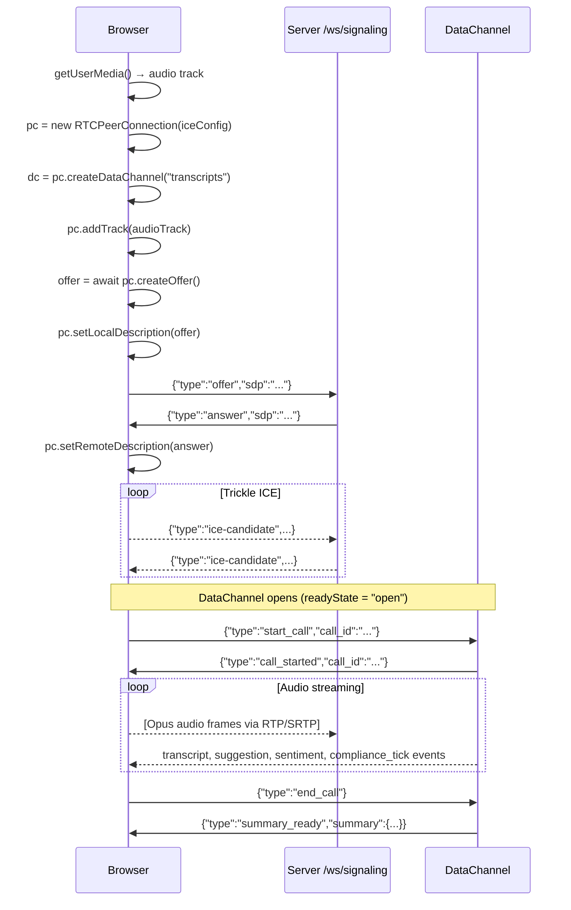

# WebRTC Signaling Protocol

Frontend integration guide for the AI Sales Copilot real-time audio pipeline.

## Overview

Two transport options — use WebRTC when available, fall back to REST automatically.

```
Primary:  getUserMedia → RTCPeerConnection → /ws/signaling (SDP/ICE) → DataChannel
Fallback: MediaRecorder → POST /api/transcribe-chunk (if ICE fails)
```

---

## 1. Authentication

All endpoints use JWT from `POST /api/auth/login`.

- WebSocket: pass token in query param (`?token=<jwt>`) — browsers cannot set headers on WS.
- REST: standard `Authorization: Bearer <jwt>` header.

Allowed roles: `agent`, `admin`.

---

## 2. WebRTC Path

### 2.1 Signaling WebSocket

```
WS ws://host/ws/signaling?token=<jwt>
```

Keep this WS open during ICE negotiation. It can be closed once the DataChannel is open.

#### Client → Server messages

```jsonc
// Step 1: Send SDP offer
{ "type": "offer", "sdp": "<SDP string from pc.localDescription.sdp>" }

// Step 3: Trickle ICE — send as candidates are gathered
{
  "type": "ice-candidate",
  "candidate": "candidate:...",   // RTCIceCandidate.candidate
  "sdpMid": "0",
  "sdpMLineIndex": 0
}
```

#### Server → Client messages

```jsonc
// Step 2: SDP answer
{ "type": "answer", "sdp": "<SDP string>" }

// Step 3: Server ICE candidates (trickle)
{
  "type": "ice-candidate",
  "candidate": "candidate:...",
  "sdpMid": "0",
  "sdpMLineIndex": 0
}

// On auth failure — WS closes with code 4001
```

### 2.2 ICE Configuration

Use these ICE servers when creating `RTCPeerConnection`:

```js
const pc = new RTCPeerConnection({
  iceServers: [
    { urls: "stun:stun.l.google.com:19302" }
    // TURN added by backend if configured — not needed for LAN demo
  ]
});
```

### 2.3 DataChannel: `transcripts`

Create **one** DataChannel named `"transcripts"` **before** creating the offer.  
It is bidirectional — carries control messages inbound and events outbound.

```js
const dc = pc.createDataChannel("transcripts");
```

#### Client → Server (control messages over DataChannel)

```jsonc
// Signal start of a call
{ "type": "start_call", "call_id": "optional-uuid", "language_hint": "uz" }

// Signal end of call — triggers summary generation
{ "type": "end_call" }

// Manually trigger intake extraction (before 60 s auto-trigger)
{ "type": "trigger_intake_extraction" }
```

#### Server → Client (event messages over DataChannel)

```jsonc
{ "type": "call_started", "call_id": "uuid" }

{ "type": "transcript", "call_id": "...", "speaker": "agent|customer",
  "text": "...", "ts": 1700000000.0 }

{ "type": "suggestion", "call_id": "...",
  "text": ["• bullet 1", "• bullet 2"], "trigger": "customer text prefix" }

{ "type": "sentiment", "call_id": "...",
  "sentiment": "positive|negative|neutral", "confidence": 0.85 }

{ "type": "compliance_tick", "call_id": "...", "phrase_id": "phrase_001" }

{ "type": "intake_proposal", "call_id": "...",
  "data": { "customer_name": "...", "customer_passport": "...",
             "customer_region": "...", "confidence": 0.9 } }

{ "type": "summary_ready", "call_id": "...",
  "summary": { "outcome": "...", "objections": [], "next_action": "..." } }

{ "type": "error", "call_id": "...", "code": "STT_FAIL|LLM_TIMEOUT", "message": "..." }
```

### 2.4 Full Connection Sequence



---

## 3. REST Fallback Path

Trigger when: `pc.iceConnectionState === "failed"` or `"disconnected"` for >5 s.

### Trigger logic

```js
pc.oniceconnectionstatechange = () => {
  if (pc.iceConnectionState === "failed") {
    switchToRestFallback();
  }
};

let disconnectedTimer = null;
pc.oniceconnectionstatechange = () => {
  if (pc.iceConnectionState === "disconnected") {
    disconnectedTimer = setTimeout(switchToRestFallback, 5000);
  } else if (disconnectedTimer) {
    clearTimeout(disconnectedTimer);
    disconnectedTimer = null;
  }
};
```

### Fallback implementation

```js
async function switchToRestFallback() {
  pc.close();
  const mediaRecorder = new MediaRecorder(stream, { mimeType: "audio/webm;codecs=opus" });
  const callId = crypto.randomUUID();

  mediaRecorder.ondataavailable = async (e) => {
    if (e.data.size === 0) return;
    const form = new FormData();
    form.append("audio", e.data, "chunk.webm");
    form.append("call_id", callId);
    form.append("lang_hint", "uz");
    const resp = await fetch("/api/transcribe-chunk", {
      method: "POST",
      headers: { Authorization: `Bearer ${token}` },
      body: form,
    });
    const { events } = await resp.json();
    events.forEach(handleEvent);  // same handler as DataChannel messages
  };

  mediaRecorder.start(2000);  // 2 s chunks

  // End call
  stopBtn.onclick = async () => {
    mediaRecorder.requestData();
    mediaRecorder.stop();
    const form = new FormData();
    form.append("audio", new Blob([], { type: "audio/webm" }), "empty.webm");
    form.append("call_id", callId);
    form.append("final", "true");
    const resp = await fetch("/api/transcribe-chunk", {
      method: "POST",
      headers: { Authorization: `Bearer ${token}` },
      body: form,
    });
    const { events } = await resp.json();
    events.forEach(handleEvent);  // includes summary_ready
  };
}
```

### REST endpoint contract

```
POST /api/transcribe-chunk
Authorization: Bearer <jwt>
Content-Type: multipart/form-data

Fields:
  audio       File    webm/opus or wav (any ffmpeg-decodable format)
  call_id     str     UUID for this call session
  lang_hint   str?    "uz" | "ru" | "en"  (optional)
  final       bool    true = last chunk, triggers summary

Response 200:
{
  "call_id": "uuid",
  "events": [ ...same event shapes as DataChannel... ]
}

Response 422: audio decode failure
Response 401: missing/invalid token
Response 403: wrong role
```

---

## 4. Reconnection Strategy (WebRTC)

If `pc.connectionState === "failed"`:
1. Tear down the old PC.
2. Wait 500 ms.
3. Create a new PC and repeat the signaling flow with the **same `call_id`**.  
   The server has kept per-call state (transcript, compliance) in memory.
4. After 2 failed reconnect attempts, switch to REST fallback permanently.

---

## 5. Notes for Implementors

- Do **not** send audio until the DataChannel `readyState` is `"open"` and `call_started` is received.
- The `suggestion` event only fires for bank-related transcript text (guardrail drops off-topic speech).
- `intake_proposal` fires once automatically at 60 s, or on demand via `trigger_intake_extraction`.
- All suggestion text is in Uzbek.
- `customer_passport` is scrubbed from supervisor WebSocket events but present in `intake_proposal` on the agent DataChannel.
